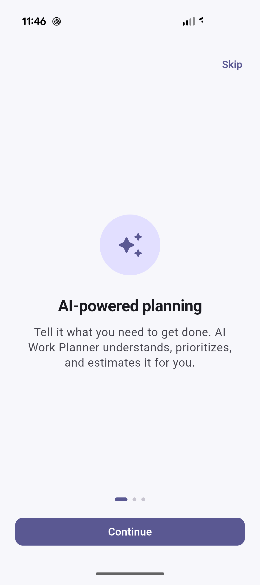
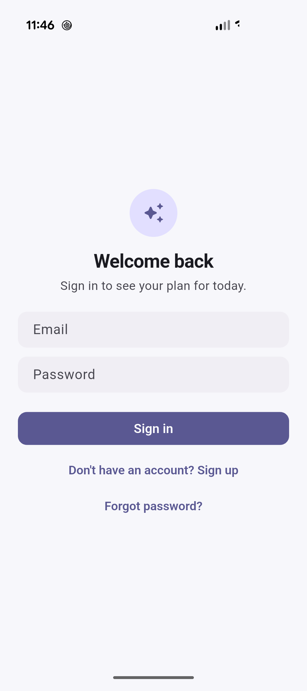
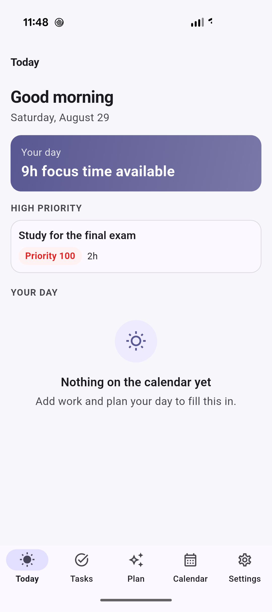
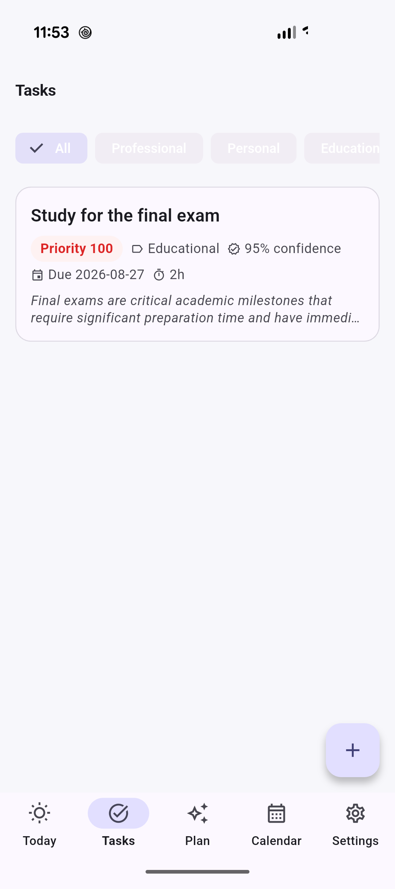
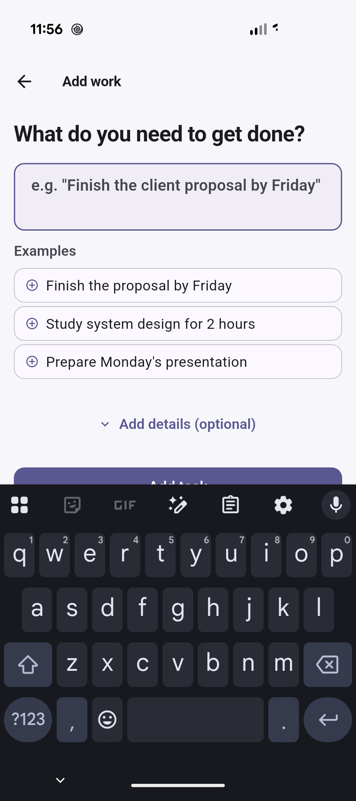
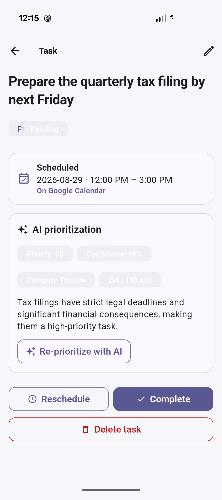
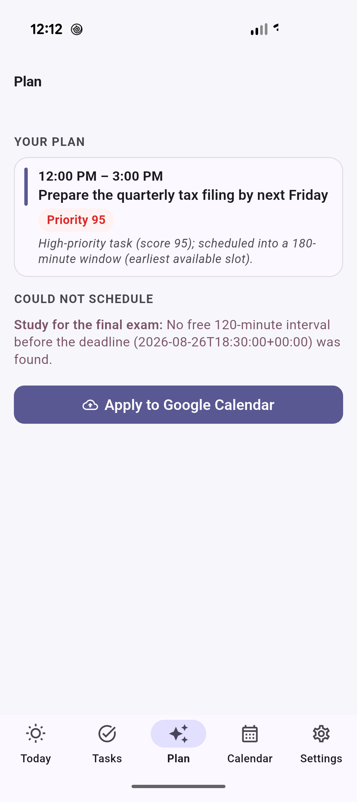
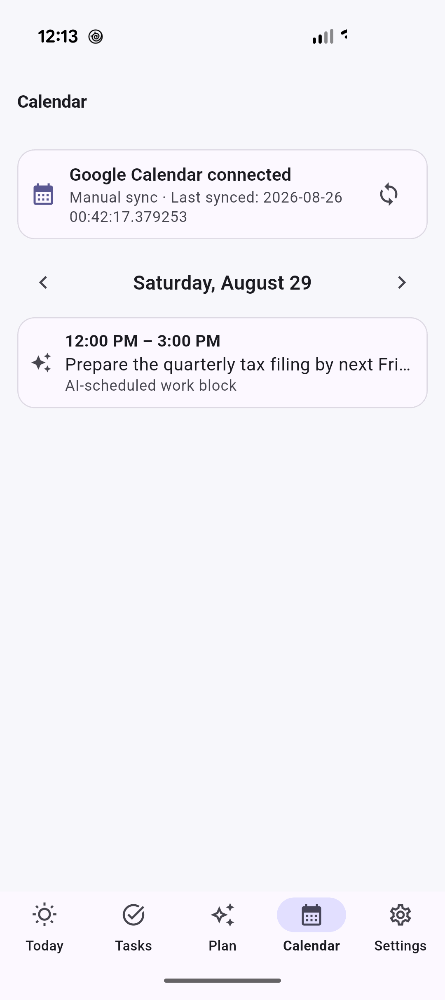

# AI Work Planner

**AI-assisted task prioritization and scheduling.** Enter a task in plain English, Gemini reads it and assigns a priority, category, confidence score, and time estimate, and a deterministic scheduling engine builds a plan around your deadlines and real Google Calendar availability — synced back to Calendar, and to every signed-in device, automatically.

[](LICENSE.md)
[](../../actions/workflows/backend-ci.yml)
[](../../actions/workflows/mobile-ci.yml)
[](../../actions/workflows/web-ci.yml)

> Source-available under the [PolyForm Noncommercial License 1.0.0](LICENSE.md) — free for any noncommercial use; commercial use requires a separate license from the copyright holder.

---

## Screenshots

Captured live from the app running on a physical Android device, signed in against the real backend with a real Gemini and Google Calendar connection.

| | |
|---|---|
|  **Onboarding** |  **Sign in** |
|  **Today** — focus time, high-priority tasks, merged agenda |  **Tasks** — category filters, AI priority/confidence |
|  **Add Work** — natural-language task capture |  **Task detail** — AI prioritization + live Calendar sync status |
|  **Plan** — AI-proposed schedule from real Calendar availability |  **Calendar** — connected, merged agenda, AI-scheduled block |

## What it does

1. **Capture** — type a task in plain English (e.g. *"Prepare the quarterly tax filing by next Friday"*); no separate fields required.
2. **Prioritize** — "Prioritize with AI" returns a priority score, confidence, category, effort estimate, and a one-line reasoning — an explicit action, never automatic.
3. **Plan** — "Plan my day/week" combines every prioritized task with real Google Calendar free/busy data through a deterministic scheduling engine, returning a reviewable proposal.
4. **Apply** — approving the proposal creates real Google Calendar events, records the resulting event IDs, and is safe to re-run.
5. **Sync** — changes made directly in Google Calendar flow back into the app, and every change propagates live to all signed-in devices — no manual refresh, no polling.

## Tech stack

| Layer | Technology |
|---|---|
| Mobile | Flutter (iOS + Android) |
| Web dashboard | Next.js + TypeScript |
| Backend | FastAPI (Python) |
| Database / Auth / Realtime | Supabase (PostgreSQL, Row Level Security, Realtime) |
| AI prioritization | Google Gemini, structured output |
| Calendar integration | Google Calendar API — OAuth 2.0, two-way sync, push notifications |
| CI | GitHub Actions (per-app pipelines) |

## Status

Auth, task management, AI prioritization, Google Calendar integration (read + write), a timezone-aware scheduling engine, an idempotent Apply-to-Calendar flow, and two-way Calendar synchronization with live cross-device propagation are implemented end to end. The Flutter mobile app is the primary deliverable and has a complete, polished flow: onboarding, sign-in, Today, natural-language task capture, AI prioritization, planning, applying to Calendar, and live sync. The web client is a functional, minimal dashboard. Team calendars, subscription billing, and a production deployment target are not yet built.

## Repository structure

```text
/mobile     Flutter app (iOS/Android)
/web        Next.js + TypeScript web dashboard
/backend    FastAPI backend
/database   SQL migrations + seed data (Supabase Postgres)
/docs       Architecture, decisions, progress log, screenshots
/infra      Local Docker development environment
/.github    CI workflows
```

## Documentation

- [`/docs/architecture.md`](docs/architecture.md) — system architecture and technology rationale
- [`/docs/decisions.md`](docs/decisions.md) — architecture decision log
- [`/docs/progress.md`](docs/progress.md) — what's done, what's planned

## License

Source-available under the [PolyForm Noncommercial License 1.0.0](LICENSE.md). Free to use, modify, and distribute for any noncommercial purpose. **Commercial use is not permitted** without a separate license from the copyright holder — see [`LICENSE.md`](LICENSE.md) for full terms.
